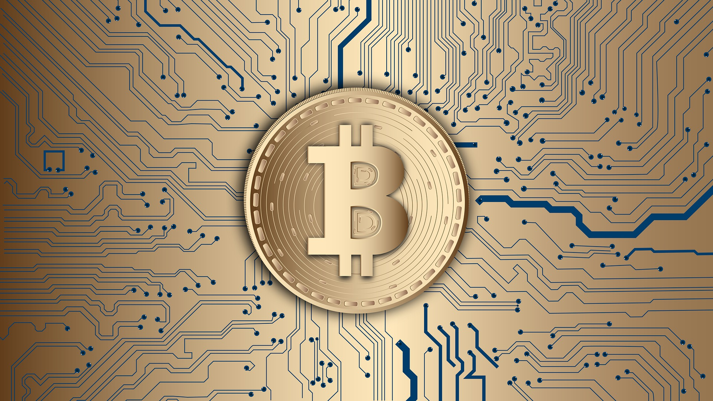

# Looking forward to invest in Bitcoin ? Is it Illegal to buy bitcoin in India ?

> Accorging to [The Wire.in](https://thewire.in/tech/will-2021-be-the-year-when-india-finally-clarifies-laws-around-cryptocurrencies)
> A high-level committee suggested that all the private cryptocurrencies, except any virtual currencies issued by state, will be prohibited in India.

There is a new government’s bill in India called as The Cryptocurrency and Regulation of Official Digital Currency Bill, 2021. Introduced in view to ban all Private cryptocurrencies in India.

### And it also empowers RBI(Reserve Bank of India) to create its own crytocurrency here in India.

Earlier, RBI also demanded banks to stop dealing with any entities related to cryptocurrency, But then in 2020 Supreme court lifted the regulation saying it is illegal.

According to analystics There are 218 Blockchain startups in India and growing everyday. So what about them ? is this a good step ?

As of now the bill is certain that it will ban only Private wallets.

Read more on difference between public and private blockchain: [so what are difference between public and private blockchain ? wikipedia](https://en.wikipedia.org/wiki/Blockchain#:~:text=In%20contrast%20to%20public%20blockchain,name%20of%20'consortium'%20blockchains.)

While popular Public are:

1.  Bitcoin
2.  Litecoin
3.  Ripple
4.  Ethereum

and some Private are:

1.  Monero
2.  Particle
3.  Dash
4.  Zcash

So what are your opinion and views on this new Bill, please share:
